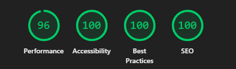

# ATI V2 — Auxiliar de Atendimentos 🚀

[](https://react.dev/)
[](https://www.typescriptlang.org/)
[](https://vitejs.dev/)
[](https://firebase.google.com/)
[](https://opensource.org/licenses/MIT)

O **ATI (Auxiliar de Atendimentos)** é um ecossistema web moderno desenvolvido para elevar a produtividade de equipes de suporte e telecomunicações. Ele centraliza ferramentas essenciais, automatiza processos repetitivos e facilita a comunicação interna em uma interface intuitiva e performática.

[Acesse a demonstração](https://vituali.github.io/ATI/)

---

## 🇧🇷 Português

### 🌟 Funcionalidades Principais

-   **💬 Chat Setorial em Tempo Real:** Comunicação ágil dividida por departamentos (Geral, TI, Financeiro, Suporte, Comercial) via Firebase.
-   **⚡ Respostas Rápidas Inteligentes:** Biblioteca de textos padronizados com suporte a variáveis dinâmicas (saudações automáticas) e organização via Drag & Drop.
-   **📋 Modelos de O.S. (SGP):** Templates prontos para agilizar o preenchimento de Ordens de Serviço.
-   **📄 Conversor de Aditivos (PDF):** Extração inteligente de dados de contratos PDF diretamente no navegador, gerando textos de instalação/retirada.
-   **📝 Notas & Tarefas:** Bloco de notas pessoal com sistema de checklists e controle de status (Pendente, Em Andamento, Concluído).
-   **🔐 Central de Acessos:** Consulta rápida a IPs, credenciais e sistemas críticos.
-   **🛡️ Painel Administrativo:** Gestão granular de usuários, permissões e comunicados globais.
-   **🎨 Personalização Total:** Temas Claro/Escuro e planos de fundo dinâmicos (suporta vídeos `.mp4` e imagens).

### 🏗️ Arquitetura e Padrões

O projeto segue uma estrutura organizada para escalabilidade e manutenção:

-   **UI Reutilizável:** Componentes genéricos em `src/components/ui/`.
-   **Layout Base:** Estrutura fixa do sistema em `src/components/layout/`.
-   **Lógica de Negócio:** Hooks customizados em `src/hooks/` (ex: `useUser`, `useNotification`).
-   **Estilização:** CSS modular (arquivo por componente) utilizando variáveis globais para espelhamento de temas.
-   **Segurança:** Sistema de permissões RBAC (Role-Based Access Control) por Setor e Cargo.

### ⚡ Performance & Calidade (Lighthouse)

Comprometimento total com a experiência do usuário e otimização:



-   **Performance:** 96 (Extremamente rápido mesmo processando PDFs locais)
-   **Acessibilidade:** 100 (Totalmente inclusivo)
-   **Melhores Práticas:** 100 (Código seguindo padrões modernos)
-   **SEO:** 100 (Otimizado para mecanismos de busca)

### 🚀 Como Executar Localmente

1.  **Clone o projeto:**
    ```bash
    git clone https://github.com/Vituali/ATI.git
    cd ATI
    ```

2.  **Instale as dependências:**
    ```bash
    npm install
    ```

3.  **Configuração do Firebase:**
    Crie um arquivo `.env` na raiz do projeto com suas chaves do Firebase Console.

4.  **Inicie o desenvolvimento:**
    ```bash
    npm run dev
    ```

---

## 🇺🇸 English

### 🌟 Key Features

-   **💬 Real-Time Sector Chat:** Instant messaging separated by company departments using Firebase Realtime Database.
-   **⚡ Smart Quick Replies:** Library of standardized snippets with dynamic variables and drag-and-drop sorting.
-   **📋 SGP Templates:** Standardized templates for fast Service Order completion.
-   **📄 PDF Additive Converter:** Client-side parsing of contract PDFs to automate installation and withdrawal logs.
-   **📝 Personal Workspace:** Notes and task management with checklist support and status tracking.
-   **🔐 Access Hub:** Quick reference for internal IPs, credentials, and system links.
-   **🛡️ Admin Suite:** User role management, permissions, and global system announcements.
-   **🎨 Dynamic UI:** Native Light/Dark mode and customizable backgrounds (Images/Videos).

### 🏗️ Architecture & Standards

-   **Modular Design:** Components separated by responsibility (UI, Layout, App).
-   **Custom Hooks:** Business logic decoupled from view (Auth, Notifications, Permissions).
-   **Performance:** Local storage persistence for themes and backgrounds, optimized Firebase listeners.
-   **RBAC:** Role-Based Access Control implemented for granular security.

### ⚡ Performance & Quality (Lighthouse)

Full commitment to speed and high-quality standards:


-   **Performance:** 96
-   **Accessibility:** 100
-   **Best Practices:** 100
-   **SEO:** 100

### 🚀 Getting Started

1.  **Clone Repo:** `git clone https://github.com/Vituali/ATI.git`
2.  **Install:** `npm install`
3.  **Env Setup:** Create `.env` based on your Firebase configuration.
4.  **Launch:** `npm run dev`

---

## 📄 Licença

Este projeto está sob a licença MIT. Veja o arquivo [LICENSE](LICENSE) para mais detalhes.

---
Desenvolvido com ❤️ por [Vituali](https://github.com/Vituali)
