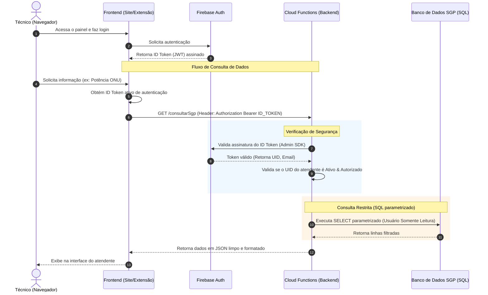

# Análise Técnica: Integração Segura com o Banco de Dados do SGP

Este documento apresenta a análise arquitetural, riscos de segurança e o plano de implementação para integrar de forma segura as consultas ao banco de dados do **SGP (Sistema de Gestão de Provedores)** no ecossistema **ATI V2** (Site e Extensão do Chrome), considerando a infraestrutura e o código atualmente implementados no projeto.

---

## 1. Análise da Arquitetura Atual e Riscos

Atualmente, o ecossistema ATI V2 é composto por:
1. **Frontend (Site SPA):** Desenvolvido em React 19 + Vite 6 + TS 5.8, hospedado estaticamente no **GitHub Pages** (`https://vituali.github.io/ATI`).
2. **Extensão do Chrome (Manifest V3):** React 18 + Vite 5 + TS 5.2, rodando localmente no navegador dos atendentes, comunicando-se com o site via uma ponte de `postMessage` (SSO Reverso).
3. **Backend Serverless (Firebase Cloud Functions):** Funções em Node.js (v2) configuradas na pasta [functions/](file:///c:/Users/Dell/Documents/GitHub/ati/functions) que processam requisições HTTP e salvam dados no Realtime Database.
4. **Bancos de Dados Firebase:** Realtime Database (para dados rápidos/chat) e Cloud Firestore (dados estruturados e cache de clientes).

### ⚠️ Riscos Críticos de Acesso Direto pelo Frontend
Acessar o banco de dados SQL do SGP diretamente a partir do frontend (GitHub Pages ou Extensão) apresenta riscos extremos e inaceitáveis de segurança:

> [!CAUTION]
> **1. Exposição de Credenciais Críticas**
> Para que o frontend conecte diretamente no banco SQL, as credenciais de acesso (IP, porta, usuário e senha) precisariam estar embutidas no código JavaScript compilado. Qualquer usuário ou terceiro mal-intencionado acessando a página poderia ler as credenciais através da aba *Network* ou inspecionando o código fonte da extensão.

> [!WARNING]
> **2. Exposição da Porta do Banco na Internet Pública**
> Conexões diretas de banco de dados a partir de navegadores não utilizam protocolos HTTP/S padrões. Seria necessário expor a porta do banco de dados (ex: PostgreSQL `5432` ou MySQL `3306`) do SGP diretamente para a internet (IP público `0.0.0.0/0`), tornando-o alvo imediato de ataques de força bruta, port scanning e exploração de vulnerabilidades zero-day.

> [!WARNING]
> **3. Falta de Controle de Queries (Injeção e Roubo de Dados)**
> Sem um intermediário, o frontend teria que ditar as consultas. Caso um atendente malicioso ou um invasor altere os parâmetros da requisição ou intercepte a conexão, ele poderia executar queries SQL arbitrárias, realizando exfiltração em massa de dados confidenciais (PII de clientes, faturamento, logins, etc.) ou indisponibilizando o banco (`DROP DATABASE`, `DELETE`).

> [!IMPORTANT]
> **4. Não-Conformidade com a LGPD**
> O acesso direto e inseguro a dados pessoais (como endereços, CPFs e telefones de mais de 22.000 clientes cadastrados no SGP) viola frontalmente a Lei Geral de Proteção de Dados (LGPD) no Brasil, podendo gerar multas pesadas e responsabilização judicial para a ATI Internet.

---

## 2. Solução Recomendada: Backend Intermediário com Firebase Cloud Functions

A abordagem correta e segura exige um **backend intermediário** atuando como ponte e validador de acesso. 

A melhor escolha para este projeto é aproveitar a infraestrutura de **Firebase Cloud Functions (v2)** já existente na pasta [functions/](file:///c:/Users/Dell/Documents/GitHub/ati/functions).



### Por que Firebase Cloud Functions?
1. **Reaproveitamento de Estrutura:** O projeto já possui a pasta [functions/](file:///c:/Users/Dell/Documents/GitHub/ati/functions) configurada e integrada à pipeline de deploys (`firebase.json`, scripts de serve/deploy no `package.json`).
2. **Integração Nativa de Autenticação:** A validação de tokens gerados pelo Firebase Auth no frontend é imediata e de baixíssima latência usando o SDK oficial `firebase-admin` (já instalado).
3. **Escalabilidade para Zero:** Não há custo de servidor ativo o tempo todo. A função é cobrada apenas por execução (milissegundos de uso), caindo na franquia gratuita do Firebase na maior parte do tempo.
4. **Segurança de Credenciais:** As credenciais do banco SGP ficam armazenadas no **Google Cloud Secret Manager** e são injetadas na função sob demanda, nunca expostas ao cliente.

---

## 3. Plano de Implementação Técnico

### Fase 1: Configuração do Banco de Dados SGP (SQL)
Para garantir o princípio do privilégio mínimo no banco de dados do SGP:

1. **Criação de Usuário Somente Leitura (SQL):**
   ```sql
   -- Exemplo para PostgreSQL (comum no SGP)
   CREATE USER ati_backend_reader WITH PASSWORD 'UmaSenhaExtremamenteForteEAleatoria';
   GRANT CONNECT ON DATABASE sgp_db TO ati_backend_reader;
   GRANT USAGE ON SCHEMA public TO ati_backend_reader;
   ```
2. **Criação de Views de Dados Específicos:**
   Em vez de liberar acesso a tabelas brutas, crie views que limitem as colunas visíveis.
   ```sql
   CREATE VIEW view_ati_tecnicos_cliente AS
   SELECT 
       c.id, c.nome, c.status, 
       o.olt_nome, o.pon_porta, o.onu_potencia,
       c.endereco, c.bairro, c.telefone
   FROM clientes c
   INNER JOIN onus o ON c.onu_id = o.id;

   GRANT SELECT ON view_ati_tecnicos_cliente TO ati_backend_reader;
   ```
3. **Restrição de Firewall (IP Whitelisting):**
   Configure o firewall do banco do SGP para aceitar conexões SQL **somente** vindas dos IPs de saída do Firebase Cloud Functions (ou configure um Cloud NAT/VPC Connector no Google Cloud para obter um IP estático dedicado).

---

### Fase 2: Implementação no Backend ([functions/index.js](file:///c:/Users/Dell/Documents/GitHub/ati/functions/index.js))

1. **Adicionar o Driver do Banco de Dados nas Dependências:**
   Instale o driver do banco utilizado pelo SGP. Exemplo para PostgreSQL:
   ```bash
   cd functions
   npm install pg
   ```

2. **Criar a Cloud Function Segura (`consultarSgp`):**
   Modificar o arquivo [functions/index.js](file:///c:/Users/Dell/Documents/GitHub/ati/functions/index.js) adicionando a nova rota:

```javascript
const { onRequest } = require("firebase-functions/v2/https");
const { Client } = require("pg"); // Driver Postgres
const admin = require("firebase-admin");

// Segredos gerenciados de forma segura
const SGP_DB_CONFIG = {
  host: process.env.SGP_DB_HOST,
  port: process.env.SGP_DB_PORT || 5432,
  database: process.env.SGP_DB_NAME,
  user: process.env.SGP_DB_USER,
  password: process.env.SGP_DB_PASSWORD,
  ssl: { rejectUnauthorized: false } // Habilite SSL
};

exports.consultarSgp = onRequest({ cors: ALLOWED_ORIGINS }, async (req, res) => {
  // 1. Validação do Token de Autenticação (JWT)
  const authHeader = req.headers.authorization;
  if (!authHeader || !authHeader.startsWith("Bearer ")) {
    return res.status(401).json({ error: "Não autorizado. Token não fornecido." });
  }

  const idToken = authHeader.split("Bearer ")[1];

  try {
    // Valida o Token usando o Firebase Admin SDK
    const decodedToken = await admin.auth().verifyIdToken(idToken);
    const uid = decodedToken.uid;

    // 2. Validação Adicional: Verifica se o atendente está ATIVO no Realtime Database
    const db = admin.database();
    const atendenteSnap = await db.ref(`uid_index/${uid}`).get();
    if (!atendenteSnap.exists()) {
      return res.status(403).json({ error: "Acesso proibido. Atendente não cadastrado." });
    }

    // 3. Extração e sanitização dos filtros da consulta
    const { tipo, termo } = req.query; // Ex: tipo=olt & termo=OLT_CENTRAL
    
    if (!tipo || !termo) {
      return res.status(400).json({ error: "Parâmetros 'tipo' e 'termo' são obrigatórios." });
    }

    // 4. Execução da query SQL estritamente parametrizada (Previne SQL Injection)
    const sqlClient = new Client(SGP_DB_CONFIG);
    await sqlClient.connect();

    let queryText = "";
    let queryParams = [termo];

    if (tipo === "olt") {
      queryText = "SELECT * FROM view_ati_tecnicos_cliente WHERE olt_nome = $1";
    } else if (tipo === "pon") {
      queryText = "SELECT * FROM view_ati_tecnicos_cliente WHERE pon_porta = $1";
    } else if (tipo === "cliente") {
      queryText = "SELECT * FROM view_ati_tecnicos_cliente WHERE id = $1 OR nome ILIKE $2";
      queryParams = [parseInt(termo) || 0, `%${termo}%`];
    } else {
      await sqlClient.end();
      return res.status(400).json({ error: "Tipo de consulta inválido." });
    }

    const dbResult = await sqlClient.query(queryText, queryParams);
    await sqlClient.end();

    // 5. Retorna o resultado limpo
    res.json({ ok: true, data: dbResult.rows });

  } catch (error) {
    console.error("Erro na verificação de autenticação ou consulta SGP:", error);
    res.status(500).json({ error: "Erro interno ao processar a consulta." });
  }
});
```

---

### Fase 3: Integração no Frontend (Site e Extensão)

A lógica de autenticação já consolidada em [Site/src/services/auth.ts](file:///c:/Users/Dell/Documents/GitHub/ati/Site/src/services/auth.ts) fornece o ID token por meio do fluxo de sincronização. Podemos consumi-lo e realizar as chamadas seguras.

1. **Implementar a Chamada da API no Frontend (Exemplo em TS):**
   ```typescript
   import { auth } from './firebase';

   export async function buscarDadosSgp(tipo: 'olt' | 'pon' | 'cliente', termo: string) {
     const user = auth.currentUser;
     if (!user) throw new Error("Usuário não autenticado no Firebase.");

     // Garante token atualizado
     const idToken = await user.getIdToken(true);

     const url = `https://site-ati-75d83.web.app/consultarSgp?tipo=${tipo}&termo=${encodeURIComponent(termo)}`;
     // Se estiver rodando localmente no emulador:
     // const url = `http://127.0.0.1:5001/site-ati-75d83/us-central1/consultarSgp?...`

     const response = await fetch(url, {
       method: 'GET',
       headers: {
         'Authorization': `Bearer ${idToken}`,
         'Content-Type': 'application/json'
       }
     });

     if (!response.ok) {
       const errData = await response.json();
       throw new Error(errData.error || "Falha na consulta.");
     }

     return await response.json();
   }
   ```

2. **Integração na Extensão (Service Worker):**
   A extensão consome o ID Token sincronizado pelo SSO e armazenado em `chrome.storage.session` para fazer requisições idênticas ao backend sempre que o atendente precisar de informações contextuais rápidas na tela do ChatMix.

---

## 4. Custos Estimados (Google Cloud / Firebase)

O uso de Cloud Functions pelo plano Blaze (Pay-as-you-go) possui uma das melhores relações de custo-benefício do mercado, pois os primeiros limites mensais são gratuitos (Free Tier):

| Recurso | Franquia Gratuita Mensal (Google) | Custo Estimado Excedente | Consumo Estimado (Equipe de ~30 Técnicos) | Custo Final Estimado |
| :--- | :--- | :--- | :--- | :--- |
| **Invocações de Função** | 2.000.000 chamadas | \$0,40 por milhão | ~50.000 chamadas/mês | **\$0.00 (Grátis)** |
| **Tempo de Execução (GB-s)**| 400.000 GB-segundos | \$0,00001667 / GB-s | ~25.000 GB-segundos | **\$0.00 (Grátis)** |
| **Transferência de Rede** | 5 GB de saída | \$0,12 por GB | ~1 GB/mês | **\$0.00 (Grátis)** |
| **Secret Manager** | 6 versões de segredo ativas | \$0,06 por segredo ativo | 5 segredos configurados | **\$0.00 (Grátis)** |

*Nota: É necessário cadastrar um cartão de crédito no console do Firebase para ativar o Plano Blaze (necessário para realizar requisições externas para fora da rede Google), porém o faturamento final será \$0.00 caso não ultrapasse a franquia acima.*

---

## 5. Práticas de Segurança e Prevenção de Problemas de Escala

### Segurança
* **SQL Parameters:** Nunca concatene strings para montar o SQL (ex: `WHERE nome = '${termo}'`). Use placeholders (ex: `$1`, `$2`) para prevenir totalmente ataques de **SQL Injection**.
* **IP Whitelisting Dinâmico:** Como as Cloud Functions não têm IP fixo por padrão, a melhor prática é usar o **Cloud NAT** com um IP estático na Google Cloud para que o firewall do servidor SGP libere apenas esse IP específico de saída.
* **Tokens de Curta Duração:** O Firebase ID Token expira a cada 1 hora automaticamente. A chamada `user.getIdToken(true)` garante que a requisição envie sempre um token atualizado e válido.

### Escalabilidade
* **Exaustão de Conexões do Banco (Connection Pool):**
  Como as Cloud Functions são serverless e escalam horizontalmente instanciando novos containers, conexões SQL abertas persistentemente podem esgotar o pool de conexões do banco de dados SGP.
  * *Solução:* Use uma estratégia de **abre/fecha rápido de conexões** (abrir a conexão, executar a query e fechá-la imediatamente com `await sqlClient.end()`) ou implemente um proxy de conexões como o **PgBouncer** no banco de dados SGP se o volume de consultas crescer muito.
* **Cache Inteligente:**
  Informações que mudam pouco (ex: lista de clientes ativos por OLT) podem ser salvas temporariamente no cache interno da Cloud Function (variáveis globais em memória) ou guardadas no Firebase Realtime Database por algumas horas, evitando ir ao banco SGP em toda consulta repetida de técnicos.
